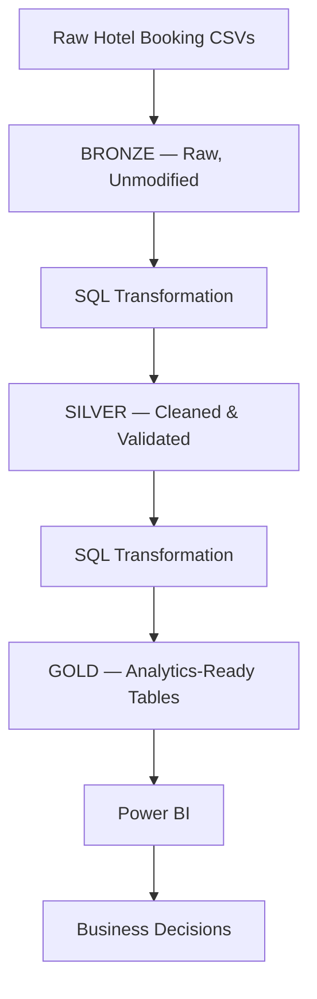

# Snowflake Bookings Analytics


An end-to-end data engineering platform built on **Snowflake**, using a **Bronze → Silver → Gold** Medallion Architecture to turn raw hotel booking CSVs into business-ready datasets for revenue, occupancy, and operational reporting in Power BI.

Written for two audiences: as an **analytics engineer**, you'll find the cleaning rules and modeling decisions behind each layer; as a **business analyst**, you'll find the questions the Gold layer exists to answer and a framework for turning those answers into action.

---

## Architecture



---

## Dashboard


---

## For the analytics engineer: what each layer does and why

**Bronze — land it, don't touch it**
Raw booking CSVs are loaded into Snowflake exactly as received. No cleaning happens here — this is the layer you fall back to if a downstream rule turns out to be wrong, and it's the only place where "what did the source system actually send us" can be answered with certainty.

**Silver — fix what's broken before anyone builds logic on top of it**
This is where most of the real engineering effort lives. Rather than one generic "clean the data" step, each Silver transformation targets a specific failure mode seen in raw booking data:

| Issue | Handling |
|---|---|
| Invalid or malformed dates | Parsed against expected formats; unparseable rows flagged rather than silently dropped |
| Inconsistent booking status values (`"Confirmed"`, `"confirmed"`, `"CONF"`, etc.) | Standardized to a controlled vocabulary |
| Malformed email addresses | Validated against a format check; invalid entries flagged, not guessed at |
| Inconsistent text fields (city names, room types) | Trimmed, case-normalized, deduplicated against known variants |
| Mixed or incorrect data types | Explicitly cast (dates, decimals, IDs) so Gold models never inherit ambiguous typing |

The principle: Gold models should never need a `TRIM()` or `CASE WHEN` to compensate for a value that should have been fixed upstream. If a Gold query needs defensive SQL, that's a sign a Silver rule is missing.

**Gold — three tables, three different jobs**
- **Booking fact table** — the clean, one-row-per-booking grain everything else rolls up from.
- **Daily booking summary** — pre-aggregated for time-series reporting (revenue trend, booking volume) without repeatedly scanning the fact table.
- **City-level revenue aggregation** — pre-aggregated for geographic reporting, so Power BI isn't doing city-level `GROUP BY`s over the full fact table on every dashboard load.

Splitting these out isn't just performance — it also means "daily revenue" and "city revenue" each have exactly one definition, computed once, rather than being re-derived per Power BI visual (a mismatch this pattern is specifically designed to avoid).

---

## For the business analyst: what the Gold layer is built to answer

The Gold tables map directly onto four business questions. Below is the analytical lens for each, with the kind of insight and recommendation the model is designed to surface — swap in your live numbers here once you've pulled them.

### 1. Revenue trend (daily booking summary)
**What to look for:** seasonality (weekday vs. weekend, holiday spikes), and any sudden drop that mirrors a booking-volume drop rather than a pricing change — that distinction tells you whether you have a demand problem or a pricing problem.
**Typical recommendation:** if revenue dips track order-volume dips exactly, focus on demand generation (promotions, channel mix); if revenue dips while volume holds steady, focus on rate strategy (discounting, room-type mix shifting toward cheaper inventory).

### 2. Booking performance & cancellations (booking fact table)
**What to look for:** the cancellation/no-show rate by booking channel, lead time (days between booking and stay), and room type. A high cancellation rate concentrated in long-lead-time bookings usually points to a different problem (weak booking confirmation flow, no deposit) than one concentrated in a single channel (a specific OTA driving low-intent bookings).
**Typical recommendation:** if cancellations cluster by lead time, test a deposit or confirmation-reminder flow; if they cluster by channel, revisit that channel's terms or targeting rather than treating cancellations as a platform-wide issue.

### 3. Room type analysis
**What to look for:** revenue contribution vs. occupancy rate per room type — a room type can look like a strong revenue driver purely because it's priced high, while actually sitting at low occupancy. The two metrics side by side (not revenue alone) tell you where real demand is.
**Typical recommendation:** high-price/low-occupancy room types are candidates for dynamic pricing or bundling; high-occupancy/lower-price types are candidates for a modest rate increase — occupancy this consistent usually has room to absorb it.

### 4. City-level revenue
**What to look for:** revenue per booking (not just total revenue) by city — a city with fewer total bookings but higher average revenue per booking may be a better expansion target than a high-volume, low-margin city.
**Typical recommendation:** prioritize marketing spend toward cities with strong revenue-per-booking rather than raw booking count, and treat high-volume/low-margin cities as an operational-efficiency problem rather than a growth one.

---

## A framework for the three levers: sales, retention, satisfaction

Once this is running against live data, these are the specific cuts worth building next — in rough order of leverage:

- **Sales / revenue** — daily summary × room type is the fastest way to spot whether growth should come from more bookings or better rates. Start here because it's already in Gold.
- **Retention** — repeat-guest rate isn't in the current model. Adding a `guest_id`-based repeat-stay flag to the fact table would let you answer "what share of revenue comes from returning guests," which is typically the highest-leverage number in a hospitality dataset, the same way it was for retail.
- **Satisfaction** — there's no review or post-stay feedback table yet. If that data exists anywhere (survey tool, OTA reviews), joining it to `booking_id` would let cancellation rate, room type, and city all be checked against satisfaction rather than revenue alone — protecting against a strategy that grows revenue while quietly eroding guest experience.

---

## Tech stack

| Area | Technology |
|---|---|
| Data Warehouse | Snowflake |
| Transformation | SQL |
| Architecture | Medallion (Bronze / Silver / Gold) |
| BI | Power BI |
| Ingestion | CSV |

---

## Project structure

```text
snowflake_bookings_analytics/
├── sql/
│   ├── bronze/            # Raw table definitions & load scripts
│   ├── silver/             # Cleaning & validation transformations
│   └── gold/                 # Fact table + aggregation tables
├── powerbi/
│   └── dashboard_screenshots/
└── README.md
```

---

## What I'd improve next

- **A repeat-guest / retention model** — the single highest-leverage table missing from Gold, as noted above.
- **A satisfaction or review dimension** joined to `booking_id`, so revenue and satisfaction can be evaluated together rather than revenue alone driving decisions.
- **Automated Silver-layer data quality tests** (row counts, null checks, accepted-value checks on `booking_status`) running on every load rather than relying on manual review.

---

## Author

**Mohd Faizanul Haque**
Analytics Engineering · Data Modeling · Business Intelligence
GitHub: [@faizan171103](https://github.com/faizan171103)
