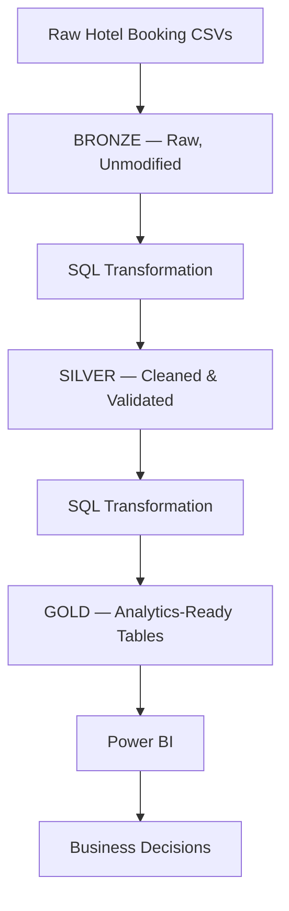

# Snowflake Bookings Analytics


An end-to-end data engineering platform built on **Snowflake**, using a **Bronze → Silver → Gold** Medallion Architecture to turn raw hotel booking CSVs into business-ready datasets for revenue, occupancy, and operational reporting in Power BI.

---

## Platform at a glance

| Metric | Value |
|---|---|
| Total Revenue | **$395.39K** |
| Total Bookings | **1,187** |
| Total Guests | **3,440** |
| Average Booking Value | **$332.26** |
| Revenue per Guest | **$114.84** |
| Confirmed / Cancelled / No-Show | **41.5% / 31.1% / 27.1%** |

---

## Architecture



The medallion pattern separates three concerns that are easy to tangle together: **fidelity to source** (Bronze), **correctness of values and types** (Silver), and **business meaning** (Gold). Each layer can be debugged and rebuilt independently.

---

## Dashboards

**Hotel Booking Analysis**


**Revenue Analysis Dashboard**


*(Add your exported PNGs to `powerbi/dashboard_screenshots/` using the filenames above, or swap in your own GitHub-hosted asset links.)*

---

## For the analytics engineer

**Bronze — land it, don't touch it**
Raw booking CSVs are loaded into Snowflake exactly as received, preserving a reprocessable source of truth if any downstream rule needs revisiting.

**Silver — fix specific, known failure modes**
Rather than a generic "clean the data" pass, each Silver transformation targets a distinct issue observed in raw booking data:

| Issue | Handling |
|---|---|
| Invalid or malformed dates | Parsed against expected formats; unparseable rows flagged, not dropped |
| Inconsistent booking status values | Standardized to a controlled vocabulary (`Confirmed`, `Cancelled`, `No-Show`) |
| Malformed email addresses | Validated against a format check; invalid entries flagged |
| Inconsistent text fields (city, room type) | Trimmed, case-normalized, deduplicated against known variants |
| Mixed or incorrect data types | Explicitly cast so Gold models never inherit ambiguous typing |

**Gold — three tables, three jobs**
- **Booking fact table** — one row per booking; the grain everything else rolls up from.
- **Daily booking summary** — pre-aggregated for the revenue trend and volume reporting.
- **City-level revenue aggregation** — pre-aggregated so Power BI isn't re-scanning the fact table for every geographic cut.

**A data-quality gap worth flagging**
`(Blank)` appears as a real segment in both `BOOKING_STATUS` and `ROOM_TYPE` — meaning a non-trivial share of records are missing a category value entirely. Before drawing firm conclusions from the status or room-type breakdowns, this should be traced back to Silver: is it a Bronze source gap, or a Silver transformation dropping values it doesn't recognize? Right now it's silently folded into the visuals rather than surfaced as a data-quality metric.

**Two dashboards, one inconsistency to reconcile**
The *Revenue by City* chart caps at roughly $2K for the top city, while *Top 10 Highest Revenue Bookings* lists individual bookings around $600 each. These are consistent with each other, but the fact that the two pages don't share a common table (one aggregates by city, one lists top individual bookings) is exactly the kind of thing a shared Power BI semantic model — built directly on the Gold fact table — would prevent from drifting apart as more pages are added.

---

## For the data analyst: key findings

**1. Booking failure is the largest problem on the dashboard, not a secondary one.**
Of 1,187 bookings, only 494 (41.5%) are Confirmed. 370 (31.1%) are Cancelled and 323 (27.1%) are No-Shows — a **58.2% combined failure rate**. At the current average booking value of $332.26, that's roughly **$230K in unrealized revenue**, nearly matching the $395.39K actually booked.

**2. There is no premium tier — growth is entirely volume-driven.**
Average booking value is $332.26, but the **top 10 highest-revenue bookings cap out at $600 each**, totaling just $7,781. With no meaningful spread above the average, there's no segment currently doing extra revenue work beyond the base room rate.

**3. Room type demand is nearly even, with no entrenched price sensitivity.**
Suite 34.5%, Standard 33.5%, Deluxe 31.9% — guests aren't defaulting to the cheapest option. That balance suggests upsell messaging at the point of booking has real room to shift the mix upward rather than fighting an existing preference for Standard.

**4. Revenue is a long tail across a large number of small markets.**
Even the top city (East Michael) sits under $2K of the $395K total — under 0.5% of total revenue from the single best-performing market. A handful of cities (East Michael, Port Jeffrey, East Matthew, North James, Lake John) show consistent, repeatable volume; the rest of the city list trails off sharply.

**5. Revenue is volatile with no clean seasonal shape.**
Monthly revenue swings roughly between $30K and $41K, peaking in **May** and **October**, dipping in **June, July, and September**. The pattern looks more like campaign- or event-driven spikes than a natural seasonal curve — worth confirming against a marketing/promo calendar rather than assumed as "high season."

---

## Recommendations, ranked by expected impact

1. **Attack the 58% cancellation/no-show rate first.** Require a deposit or partial prepayment, send automated pre-arrival confirmation reminders, and introduce a tiered cancellation policy. Recovering even 10 points of that rate (58% → 48%) is worth an estimated **~$40K** in additional realized revenue without acquiring a single new customer.
2. **Build a real premium tier.** With no booking clearing $600, introduce bundled packages — late checkout, breakfast, room upgrades, extended stay — priced meaningfully above the $332 average. This is AOV lift on demand that already exists.
3. **Reverse-engineer May and October**, then replicate whatever drove those peaks; separately diagnose the June/July/September troughs rather than treating them as expected seasonal noise.
4. **Concentrate marketing and inventory effort in proven cities** (East Michael, Port Jeffrey, East Matthew, North James, Lake John) instead of spreading spend thin across hundreds of near-zero-revenue markets.
5. **Close the `(Blank)` data-quality gap** in booking status and room type before these fields are used for any further segmentation — an engineering fix that directly improves the reliability of every finding above it.

---

## Tech stack

| Area | Technology |
|---|---|
| Data Warehouse | Snowflake |
| Transformation | SQL |
| Architecture | Medallion (Bronze / Silver / Gold) |
| BI | Power BI |
| Ingestion | CSV |

---

## Project structure

```text
snowflake_bookings_analytics/
├── sql/
│   ├── bronze/            # Raw table definitions & load scripts
│   ├── silver/             # Cleaning & validation transformations
│   └── gold/                 # Fact table + aggregation tables
├── powerbi/
│   └── dashboard_screenshots/
└── README.md
```

---

## Getting started

```bash
# Clone
git clone https://github.com/faizan171103/snowflake_bookings_analytics.git
cd snowflake_bookings_analytics

# Run Bronze load scripts, then Silver, then Gold transformations
# (see sql/bronze, sql/silver, sql/gold)

# Connect Power BI directly to the Gold layer tables in Snowflake


---

## Author

**Mohd Faizanul Haque**
Analytics Engineering · Data Modeling · Business Intelligence
GitHub: [@faizan171103](https://github.com/faizan171103)
